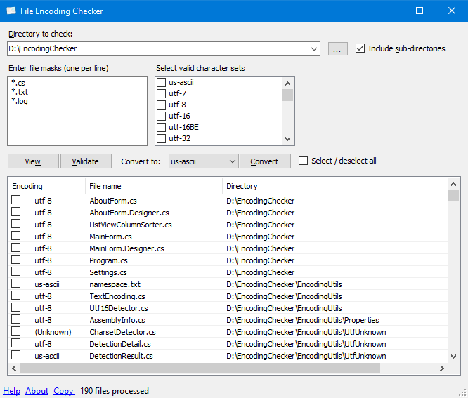

# EncodingChecker v2.0
File Encoding Checker is a GUI tool that allows you to validate the text encoding of one or more files. The tool can display the encoding for all selected files, or only the files that do not have the encodings you specify.

File Encoding Checker requires .NET 4 or above to run.

## Fixed issues
Sorting the results by clicking a column header is working now.

When viewing a directory, some files matching the file masks were not listed.

Improved performance of the list view control for faster processing of results.

Added feature to copy selected results to the Windows clipboard.

Switched to UtfUnknown library for better encoding detection (Multiple bugs from Ude fixed).

Validating the detected file encoding to avoid errors during conversion of files.

UTF-16 text files without byte-order-mark (BOM) can be detected by heuristics.

## Credits
The original project [EncodingChecker](https://archive.codeplex.com/?p=encodingchecker) on CodePlex was written by [Jeevan James](https://github.com/JeevanJames).

For encoding detection, File Encoding Checker uses the [UtfUnknown](https://github.com/CharsetDetector/UTF-unknown) library, which is a C# port of [uchardet](https://gitlab.freedesktop.org/uchardet/uchardet) library - A C++ port of the original [Mozilla Universal Charset Detector](https://dxr.mozilla.org/mozilla/source/extensions/universalchardet/).
