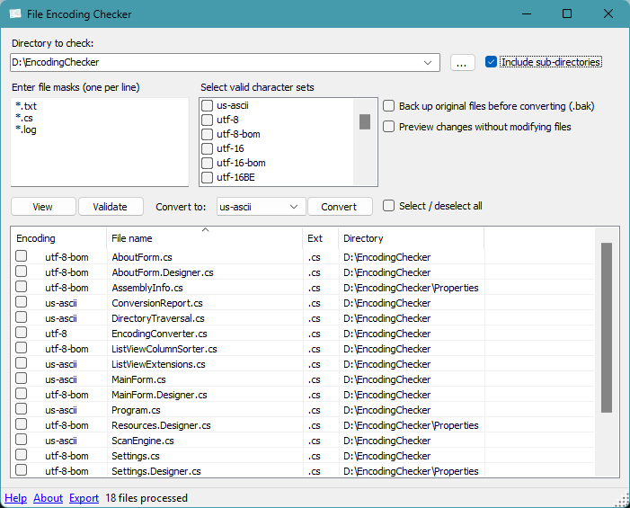

[](https://github.com/amrali-eg/EncodingChecker/actions/workflows/ci.yml)

# EncodingChecker v3.7.0

File Encoding Checker detects, validates, and converts the text encoding of one or more files. It runs either as a Windows GUI app or as a command-line tool for scripting and CI, and shares one detection/conversion engine between both.

Requires the [.NET 10 Desktop Runtime](https://dotnet.microsoft.com/download) (Windows only).

Each [release](https://github.com/amrali-eg/EncodingChecker/releases) publishes two single-file builds: `EncodingChecker.zip` (framework-dependent, requires the .NET 10 Desktop Runtime above) and `EncodingChecker-selfcontained.zip` (larger, but runs on a machine with no .NET runtime installed).



## Highlights

- Layered detection: byte-order-mark and heuristic checks for Unicode encodings, [UtfUnknown](https://github.com/CharsetDetector/UTF-unknown) for legacy code pages, each candidate independently verified by strict decoding before being trusted.
- Lossless, safe conversion: every write is verified afterward by comparing a SHA-256 hash of the decoded content, so a silent encoder substitution (e.g. an unrepresentable character) is caught and reported as an error instead of corrupting the file.
- Refuses to convert files whose encoding the bytes do not determine, naming the encodings actually in conflict, with `-From` to supply the answer yourself.
- `-Plan`/`-Apply` preflight: review what a conversion would do, then carry out exactly that — the plan is bound to the files' hashes and is refused whole if they change.
- Optional `.bak` backup before overwriting, and a `-WhatIf` dry-run mode that reports what would happen without touching any file.
- Covered by an xUnit test suite exercising the detection/conversion engine, CLI argument parsing, and CSV report formatting across multilingual content and edge cases.

## GUI usage

Launch `EncodingChecker.exe` with no arguments. Pick a directory and file filters, choose **View** to detect encodings, **Validate** against a set of accepted charsets, or **Convert** to a target encoding. Results can be exported to CSV.

Two options apply to **Convert**:

- **Back up original files before converting (.bak)** — keeps each original as `<file>.bak` before it is replaced. The equivalent of the CLI's `-Backup`.
- **Preview changes without modifying files** — reports which files *would* be converted without writing anything and without creating any `.bak`. Previewed rows keep their current encoding and stay selected, so you can review the result and then convert for real. The equivalent of the CLI's `-WhatIf`.

## Command-line usage

Launch `EncodingChecker.exe` with arguments to run in console mode instead. Run `EncodingChecker.exe -?` (or `-h`, `/?`, `--help`) at any time to print this from the tool itself.

```
EncodingChecker.exe
    -BasePath <directory>
    [-Include "<pattern1,pattern2,...>"]   # repeatable; patterns accumulate
    [-Exclude "<pattern1,pattern2,...>"]   # repeatable; patterns accumulate

    -Target "<encoding>"          # Convert mode (default); e.g. "utf-8" or "utf-8-bom"
    -Validate "<charset1,...>"    # Validate mode: flag files not in this list
    -DetectOnly                   # Read-only detection mode

    [-From "<encoding>"]          # Treat every file as this encoding instead of
                                   # detecting it (Convert mode only)
    [-Plan <path>]                # Write a conversion plan; change nothing
    [-Apply <path>]               # Carry out a plan written by -Plan

    [-Report <path>]              # Also write a CSV report to this path
    [-MaxParallelism <N>]         # Default: min(logical processor count, 4)
    [-WhatIf]                     # Convert mode: report without writing
    [-Backup]                     # Convert mode: write "<file>.bak" before overwriting
                                   # (ignored under -WhatIf, which writes nothing)
    [-Quiet]                      # Suppress per-file rows; print only a summary
    [-Verbose]                    # Print error detail and a result breakdown
    [-FailOnChanges]              # Non-zero exit code if any file needs (or, under
                                   # -Validate, fails) conversion — useful as a CI gate
```

`-Include`/`-Exclude` are comma-separated wildcard patterns, and both options may be repeated — patterns from every occurrence accumulate, so `-Include "*.cs" -Include "*.txt"` is equivalent to `-Include "*.cs,*.txt"`. A pattern with no `/` or `\` matches just the filename (e.g. `*.cs` matches at any depth); a pattern containing a separator matches the path relative to `-BasePath` instead (e.g. `src/*.cs` matches only under `src`, `\` and `/` behave the same way). `.git`, `.svn`, `.hg`, `.vs`, `.idea`, `bin`, `obj`, `node_modules`, `packages`, `dist`, `build`, and `target` directories are always skipped. Convert, Validate, and Detect-only are mutually exclusive modes.

`-Backup` only ever writes a `.bak` when a real conversion happens: a file that already matches the target is left alone, and under `-WhatIf` nothing is written at all, so no backup is created.

### Ambiguous encodings, and `-From`

Some files do not identify the encoding that wrote them. A file valid in
windows-1252 is equally valid in iso-8859-1 and in koi8-r, and each reads it as
different text; nothing in the bytes decides between them. Detection still
produces an answer, and converting on that answer rewrites the file into one of
several possible readings without saying so.

EncodingChecker refuses those conversions and names the encodings actually in
conflict:

```
Error: notes.txt: The encoding could not be determined uniquely from the file's
contents. iso-8859-1 and cp866, ibm852, ibm855, iso-8859-13, and 17 more all match
this file and would produce different text. No conversion was performed; specify
the source encoding explicitly to convert it.
```

The refusal applies only where the rival readings *disagree about the text*. A
file whose encoding is undetermined but whose candidates all decode it
identically — plain ASCII being the common case — is converted normally, because
there is nothing to protect the user from. Nor does it apply where the file's own
structure picks the encoding out: valid UTF-8, Shift_JIS or Big5 byte sequences
are not valid by accident, and codecs that accept any byte sequence are not
offering a competing reading so much as failing to object.

`-From` supplies the answer detection could not. It replaces detection and
nothing else: the bytes must still decode strictly as the named encoding, the
output is still verified to hold exactly the same text, and a failed backup still
aborts the conversion. Naming an encoding says which one it is, not "convert it
regardless".

### Preflight: `-Plan` and `-Apply`

`-Plan` writes down what a conversion would do and changes nothing. For every
file the plan records the action, the source encoding, whether it was detected or
specified, whether the bytes identify it uniquely, which encodings compete for
it, and the reason behind any refusal — as JSON, alongside a summary on stdout:

```
Selected:                     3

Will convert:                 2
  encoding determined:        2
  same text either way:       0
Already in target encoding:   0
Encoding not identified:      0
Refused, ambiguous encoding:  1
Refused, unreadable:          0

Directory:                    C:\Source
Target:                       utf-8 without BOM
Source encoding:              detected per file
Backups:                      enabled
Guarantees:                   strict codecs, verified output, atomic install, ambiguity refusal

No files modified.
```

The two indented lines break down `Will convert`; the rest sum exactly to
`Selected`, so the totals can be checked rather than trusted.

`-Apply` carries that plan out. It does not detect anything a second time: the
encodings, the target, and the backup setting all come from the plan, so
`-BasePath`, `-Target`, `-From`, and `-Backup` are rejected rather than silently
ignored. `plan.json` is the whole approval.

The binding is the point of the feature, not the preview:

- **Bound to the files.** Every scheduled file carries the SHA-256 it had when
  the plan was made, and `-Apply` verifies each one before writing anything. If
  any file has changed or been deleted in between, **nothing is converted** — not
  even the files that still match. A plan reviewed as a whole belongs to the
  directory it was reviewed against, and the files most likely to have changed
  are the ones something else is actively writing. Each file is checked once
  more at the moment it is installed, which narrows the window between that
  verification and the write.
- **Bound to the directory.** Paths are stored relative to a recorded root, so a
  plan is a document about a directory rather than about one machine. Applying a
  copy of a plan converts the tree it was approved for, not whichever tree it
  happens to sit in, and an entry that resolves outside that root is refused.
- **Bound to the conversion.** The plan records the target encoding, BOM policy,
  backup policy, whether the source encoding was detected or specified, and a
  semantics version describing the conversion behaviour it was approved under. A
  plan written under different behaviour is refused rather than carried out —
  what was approved was a conversion, not a list of filenames.

The semantics version is deliberately separate from EC's version number: it moves
only when conversion or classification behaviour changes, so a release that
changes nothing about conversion does not invalidate plans and teach people to
work around the check.

```bash
EncodingChecker.exe -BasePath . -Include "*" -Target "utf-8" -Plan plan.json
EncodingChecker.exe -Apply plan.json
```

Exit codes: `0` clean, `1` usage/argument error (nothing was scanned), `2` `-FailOnChanges` triggered, `3` the run did not complete cleanly — one or more files failed to process, the scan itself failed, or the `-Report` file could not be written, `4` cancelled (Ctrl+C).

These are the same codes as [LineEndingNormalizer](https://github.com/amrali-eg/LineEndingNormalizer), a companion Windows CLI tool that normalizes line endings, so a script driving both can share one exit-code mapping. It additionally returns `5` for a missing base directory and `6` for a reparse-point `-BasePath`, both of which are reported here as `1` — so no code means two different things across the two tools, and treating `1`, `5` and `6` alike handles either.

The CSV report (and `-DetectOnly`'s stdout) uses the columns `File,Encoding,BOM,Target,TargetBOM,Result`, where `Encoding`/`BOM` describe the original file and `Target`/`TargetBOM` the encoding and BOM state it was (or would be) converted to.

Examples:

```bash
EncodingChecker.exe -BasePath C:\Source -Include "*.cs,*.txt" -Target "utf-8"

EncodingChecker.exe -BasePath . -Include "*.cpp,*.hpp" -Target "utf-8" -WhatIf

EncodingChecker.exe -BasePath . -Include "*" -Validate "utf-8,utf-8-bom" -Report report.csv -FailOnChanges
```

## Safety model

These are the guarantees the implementation actually provides.

- Content is decoded and re-encoded through a strict `Decoder`/`Encoder` pair:
  malformed input, and content the target cannot represent, are rejected rather
  than silently replaced. There is no raw-byte conversion path — every encoding,
  Unicode or legacy, goes through decode/re-encode.
  <br>Strictness is enforced by rebuilding the encoding with its fallbacks
  supplied up front (`TextEncoding.Strict`). Assigning `Decoder.Fallback` or
  `Encoder.Fallback` *after* `GetDecoder()`/`GetEncoder()` is silently ignored by
  the `CodePagesEncodingProvider` encodings — the codec has already taken its
  fallbacks from the parent `Encoding` — which is exactly the defect the
  [independent audit](#independent-audit) found in v3.5.0 and earlier.
- Every write is verified before installation by re-decoding the temporary file
  and comparing a SHA-256 hash of its *decoded* content and BOM state against the
  source. This is a backstop behind the strict codecs, not the primary defence:
  because it compares decoded source against decoded target, a decoder that
  substitutes silently would produce agreeing hashes. Strict codecs are what
  prevent that; the hash catches anything they cannot.
- The source file is never rewritten in place: conversion writes to a new
  temporary file beside the destination, which is verified before it is
  installed.
- Immediately before installation, the destination is revalidated (length
  and last-write time) so a file changed elsewhere during conversion is not
  silently overwritten. **This is a point-in-time race check, not a
  complete elimination of every possible TOCTOU window.**
- Original file attributes and timestamps are preserved: applied to the
  temporary file before installation, so the final file's metadata is
  correct atomically along with its content.
- With `-Backup`, the original is copied to `<file>.bak` *before* the main
  file is replaced; if the backup fails, the main conversion is aborted and
  the original is left untouched. A previously read-only `.bak` is still
  replaced correctly.
  <br>**In the GUI this is on by default** (and remembered between runs). The
  audit found that conversion from a Unicode or ASCII source altered none of
  1,832 files, but roughly one in five converted from a legacy code page came
  out with different text, because single-byte code pages are mutually decodable
  and nothing in the bytes says which was intended. Such a conversion is almost
  always reversible — but only for someone who still knows which codec was used,
  and that is recorded solely in the conversion report. The CLI leaves `-Backup`
  opt-in, since a script can keep the report.
- A conversion whose source encoding cannot be determined from the file's own
  bytes is refused rather than guessed at, when the competing encodings would
  produce different text. `-From` overrides the detection, not the conversion
  safeguards. See [Ambiguous encodings](#ambiguous-encodings-and--from).
- A plan written by `-Plan` is bound to the SHA-256 of every file it schedules,
  to the directory those files are under, and to the conversion behaviour it was
  approved under. `-Apply` verifies all of them before writing anything and
  refuses the plan whole if any has changed, so a decision made about one set of
  bytes is never applied to a different one. Under `-Apply`, each source is
  re-hashed again immediately before installation. **This narrows the window
  between verification and write; it does not close it** — a source rewritten
  between that check and the replacement is still not detected, which would
  require holding every source open against writers for the whole run.
- `-BasePath` itself is rejected if it is a symbolic link, junction, or
  other reparse point. Reparse-point subdirectories are skipped during
  traversal, and a file that is (or becomes) a reparse point is rejected at
  the point of installation.
- `.bak` files and the tool's own abandoned temporary files — both the
  conversion temp file and the `-Backup` install's own temp file — are
  automatically excluded from scanning, including under a broad
  `-Include "*"`, so a later run never treats its own output as input.
- Installation uses .NET's `File.Replace` where supported; a plain,
  non-atomic move is used only when that platform support is genuinely
  unavailable, never as a silent fallback after a real replacement
  failure.
- Cleanup of the temporary file after a failure clears any inherited
  ReadOnly attribute before deleting it, and a cleanup failure can never
  replace or mask the actual error being reported — conversion results are
  returned as structured data, not thrown, so the result is already
  finalized before cleanup ever runs.
- Cancellation (Ctrl+C in the CLI) is observed between files and at
  multiple points within a single file's conversion; a cancelled run never
  leaves a half-written destination, because the destination is only
  touched by the final install step.

## Independent audit

EncodingChecker's conversion is audited end to end against four public corpora —
**5,078 files** — by a separate harness:
**[CorpusTesters](https://github.com/amrali-eg/CorpusTesters)**.

The audit answers one question per file, with no normalization of any kind and no
replacement characters permitted:

```
strict-decode(original bytes, reference codec + BOM)
    == strict-decode(converted bytes, target codec)
```

Ground truth comes from each corpus's own manifest or catalogue, never from
filenames and never from compatibility metadata. Source corpora are treated as
read-only: each is copied into a working directory and only the copy is
converted, verified after every run against the corpora's published SHA-256
hashes.

### Results for v3.6.0

Measured over the files EC actually **rewrote** — files it skipped or left
byte-identical cannot have lost anything:

| Source | Rewritten | Text preserved |
|---|---:|---:|
| Unicode + ASCII | 1,832 | 1,832 (**100.00%**) |
| Legacy code page (.NET has a codec) | 2,021 | 1,602 (79.27%) |
| No .NET codec exists | 112 | 21 (18.75%) |

Four metrics are reported separately rather than blended into one accuracy
figure, because a single number would average silent data loss against files that
merely happened to be ASCII:

| Metric | Result |
|---|---|
| Detection accuracy (exact codec identity) | 3756/4961 (75.7%) |
| Strict-decoding correctness | **5023/5023 (100%)** |
| Codec conformance | 89 divergences |
| End-to-end text preservation | 4101/4741 (86.5%) |

**Unicode and ASCII input is safe on this evidence** — not one of the 1,832 files
converted from a Unicode or ASCII source came out with different text.

**Legacy input carries the residual risk.** The dominant part of it is
source-encoding identification: single-byte code pages are mutually decodable, so
`windows-1252` text is perfectly valid `iso-8859-1` text and nothing in the bytes
distinguishes them. Forced to the correct codec, those files convert exactly.

Codec implementation differences and decoder strictness are separate conversion
risks rather than the same one, and the two interact — the detector can name the
right encoding and the conversion still alter text, because the implementation
behind that name differs from the reference.

The 89 codec divergences are known Microsoft-vs-Unicode mapping differences in
the Japanese and Chinese code pages (U+301C wave dash versus U+FF5E fullwidth
tilde, and similar) — properties of .NET's code-page tables, not of this tool.

### What it found

The audit's PHASE 0 establishes what the build under test actually does before
judging any file, and that is how the strict-fallback defect fixed in v3.6.0
([#36](https://github.com/amrali-eg/EncodingChecker/pull/36)) was found: files
whose bytes their own codec could not represent were being converted with
substituted characters and reported as `Converted`.

Blast radius, stated plainly: **4 files out of 5,078**. It was a latent
correctness hole, not mass corruption — it rarely fired because detection usually
picks a codec that *can* decode the bytes. Before and after the fix, across all
four corpora: **8 files changed outcome, all improvements, zero regressions.**

Every figure above is reproducible; the harness, its methodology and its raw
per-file evidence are documented in the CorpusTesters repository.

## Supported charsets

Over forty charsets, matching what [UtfUnknown](https://github.com/CharsetDetector/UTF-unknown) can report and .NET can encode/decode:

* ASCII
* UTF-8 (with or without a BOM)
* UTF-16 BE or LE (with or without a BOM)
* UTF-32 BE or LE (with or without a BOM)
* Arabic: iso-8859-6, windows-1256.
* Baltic: iso-8859-4, windows-1257.
* Central European: ibm852, iso-8859-2, windows-1250, x-mac-ce.
* Chinese (Traditional and Simplified): big5, GB18030, hz-gb-2312, x-cp50227.
* Cyrillic (primarily Russian): IBM855, cp866, iso-8859-5, koi8-r, windows-1251, x-mac-cyrillic.
* Estonian: iso-8859-13.
* Greek: iso-8859-7, windows-1253.
* Hebrew: iso-8859-8, windows-1255.
* Japanese: euc-jp, iso-2022-jp, shift_jis.
* Korean: euc-kr, iso-2022-kr, ks_c_5601-1987 (cp949).
* Thai: windows-874 (aliases TIS-620 and iso-8859-11 in .NET)
* Turkish: iso-8859-3, iso-8859-9.
* Western European: iso-8859-1, iso-8859-15, windows-1252.
* Vietnamese: windows-1258.

**UTF-7 is not supported.** .NET disables its UTF-7 encoder/decoder by default for security reasons (see [SYSLIB0001](https://learn.microsoft.com/dotnet/fundamentals/syslib-diagnostics/syslib0001)) — UTF-7 content can be crafted to evade validation that assumes a different encoding.

## Credits

The original project [EncodingChecker](https://archive.codeplex.com/?p=encodingchecker) on CodePlex was written by [Jeevan James](https://github.com/JeevanJames).

For encoding detection, File Encoding Checker uses the [UtfUnknown](https://github.com/CharsetDetector/UTF-unknown) library, a C# port of [uchardet](https://gitlab.freedesktop.org/uchardet/uchardet), itself a C++ port of the original [Mozilla Universal Charset Detector](https://dxr.mozilla.org/mozilla/source/extensions/universalchardet/). See [THIRD-PARTY-NOTICES.txt](./THIRD-PARTY-NOTICES.txt) for its license.

## License

[Mozilla Public License 2.0](./LICENSE)
