# How conversion works

This page explains what happens after you ask EncodingChecker to convert files. It is the same safety model in the GUI, the command line, and saved conversion plans.

## What you do

1. **View** the folder to see what EC found.
2. Select the files you want to handle and choose **Convert**.
3. Read the review before any file is changed.
4. If EC asks, choose the original source encoding if you know it.
5. Confirm the reviewed conversion.

The review tells you which files will convert, already match the target, need a legacy source choice, or cannot be processed. Cancelling leaves every source file unchanged.

## The important rule

For a file that needs conversion, EC applies this policy:

| File type | Automatic action |
| --- | --- |
| ASCII, Unicode with a BOM, or text whose encoding EC can prove from its bytes | Convert automatically |
| Legacy text or BOM-less Unicode whose encoding cannot be proven safely | Do not convert; ask you to choose the original encoding |

A file that already matches the target encoding and BOM is reported as **Unchanged** and
is not decoded or rewritten. No source choice is needed because no conversion occurs.

If you choose a source encoding, EC uses it only to read the original bytes. It does not
disable strict decoding, output verification, backup verification, or safe installation.

### BOM-less UTF-16

Without a byte-order mark, UTF-16 bytes are usually valid as both UTF-16LE and UTF-16BE.
For example, byte-swapped Latin text often lands in a valid CJK range. A detector may prefer
one order, but that preference cannot prove what the original file meant. EC therefore
strictly decodes the complete source under the opposite order before automatic conversion.
If both orders work, the file is reported as `Refused` with reason code
`AmbiguousBomlessUtf16`; no preview says it would convert, and no backup, sidecar, or output
file is created. Choose the source encoding explicitly if you know it.

## What EC does

```mermaid
flowchart LR
    A[Scan files] --> B[Decide source interpretation]
    B --> C[Build review plan]
    C --> D[Conversion is confirmed or applied]
    D --> E[Create backup if enabled]
    E --> F[Strict source decode]
    F --> G[Strict target encode]
    G --> H[Verify identical text]
    H --> I[If backed up: verify backup and write Prepared metadata]
    I --> J[Install verified output]
    J --> K[If backed up: mark metadata Completed]
```



Every step after confirmation must succeed. If decoding, encoding, verification, backup
creation, or installation fails, EC leaves that source file unchanged. Because the backup
is created first, a later refusal or failure can leave a `.bak` file beside the unchanged
source. Recovery metadata is written only after the converted output and backup both verify.

## Two ways to start a conversion

EC offers two workflows, but they do not use different conversion engines. Both use the
same source-encoding policy, strict codecs, output verification, backup checks, and safe
file installation.

**Use direct conversion for ordinary interactive work. For batch jobs or automation,
saved plan/apply is the safest workflow because it binds approval to the exact files and
settings that were reviewed.**

| Workflow | Best for | What happens |
| --- | --- | --- |
| Direct conversion | Normal GUI use and simple command-line jobs | EC scans, makes its safety decisions, and converts during one run. |
| Saved plan and apply | Important batches, automation, or approval at a later time | EC saves exactly what was reviewed, then verifies that saved decision before writing. |

### Direct conversion

The GUI normally uses the direct workflow: **View → select → Convert → review → confirm**.
The review plan exists in memory and is executed immediately after confirmation.

The command-line equivalent is:

```powershell
EncodingChecker.exe -BasePath "C:\Files" -Target utf-8 -Backup
```

Choose direct conversion when you are reviewing and converting the files in the same
session. It is simpler because there is no plan file to save or manage.

### Saved plan and apply

For a cautious batch workflow, create a plan first:

```powershell
EncodingChecker.exe -BasePath "C:\Files" -Target utf-8 -Plan plan.json
```

After reviewing it, apply that exact plan:

```powershell
EncodingChecker.exe -Apply plan.json
```

Detection and SHA-256 hashing use the same source snapshot when the plan is built. The plan
contains those hashes and the complete conversion settings. If a scheduled file changes
after review, EC rejects the whole plan instead of applying an approval to different bytes.
`-Apply` cannot be combined with `-WhatIf`: the saved plan is already the preview, while
applying it performs the reviewed writes.

### What a saved plan uniquely provides

A saved plan lets you separate review from execution. It records:

- the folder and relative file paths;
- each file's size and SHA-256;
- the detected or explicitly selected source encoding;
- the target encoding and BOM choice;
- whether backups are enabled;
- the EC plan schema and conversion-safety rules.

When you run `-Apply`, EC uses those saved decisions instead of detecting the files again.
Before writing anything, it verifies every planned file. If any file changed, disappeared,
or no longer matches the approved plan, EC rejects the entire plan.

This is useful when:

- the plan is reviewed now but applied later;
- one person prepares a batch and another approves it;
- a script must perform exactly a previously reviewed operation;
- you need a durable record of what was approved.

### What a saved plan does not provide

A plan does not improve encoding detection or make an incorrect source choice correct. It
does not disable any safety check, provide a restore command, or make the whole batch one
atomic transaction. Files are still verified and installed individually. A plan also cannot
include hidden or otherwise excluded files that EC never scanned.

Plans deliberately become invalid when their files change. Regenerate and review the plan
rather than editing its hashes or trying to force an old approval onto new bytes.

### Why EC keeps direct conversion

For everyday work, requiring everyone to save and reapply a JSON plan would add extra steps
without improving the per-file conversion checks. Direct conversion therefore remains the
simple workflow, while plan/apply is available when delayed approval, automation, or exact
reproducibility matters.

In short:

```text
Direct: scan → review → convert now
Plan:   scan → save approval → review later → verify unchanged files → convert
```

The GUI uses the same planned actions. Its **Export results** menu can save selected rows as
text, all displayed results as a diagnostic CSV report, or the exact completed conversion
journal as JSON.

For a known legacy source, supply the encoding explicitly:

```powershell
EncodingChecker.exe -BasePath "C:\Files" -Target utf-8 -From windows-1252 -Backup
```

For detailed conversion guarantees and known limits, read [Safety and recovery](SAFETY.md).
For independent corpus evidence and its limits, read [Safety audit](SAFETY-AUDIT.md).
