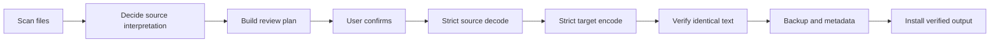

# How conversion works

This page explains what happens after you ask EncodingChecker to convert files. It is the same safety model in the GUI, the command line, and saved conversion plans.

## What you do

1. **View** the folder to see what EC found.
2. Select the files you want to handle and choose **Convert**.
3. Read the review before any file is changed.
4. For legacy text, choose the source encoding if you know it.
5. Confirm the reviewed conversion.

The review tells you which files will convert, already match the target, need a legacy source choice, or cannot be processed. Cancelling leaves every source file unchanged.

## The important rule

| File type | What EC does automatically |
| --- | --- |
| Unicode or ASCII | May convert it |
| Legacy text | Leaves it unchanged until you choose the original encoding |
| Unknown or unreadable data | Leaves it unchanged |

Choosing a legacy encoding answers only “how should these bytes be read?” It does not disable strict decoding, output verification, backups, or atomic installation.

## What EC does



Every step after confirmation must succeed. If decoding, encoding, verification, backup creation, or installation fails, EC leaves that source file unchanged.

## Plans and the command line

For a cautious batch workflow, create a plan first:

```powershell
EncodingChecker.exe -BasePath "C:\Files" -Target utf-8 -Plan plan.json
```

After reviewing it, apply that exact plan:

```powershell
EncodingChecker.exe -Apply plan.json
```

Detection and SHA-256 hashing use the same source snapshot when the plan is built. The plan contains those hashes and the complete conversion settings. If a scheduled file changes after review, EC rejects the whole plan instead of applying an approval to different bytes. `-Apply` cannot be combined with `-WhatIf`: the saved plan is already the preview, while applying it performs the reviewed writes.

The GUI uses the same planned actions. Its **Export results** menu can save selected rows as text, all displayed results as a diagnostic CSV report, or the exact completed conversion journal as JSON.

For a known legacy source, supply the encoding explicitly:

```powershell
EncodingChecker.exe -BasePath "C:\Files" -Target utf-8 -From windows-1252 -Backup
```

For the detailed guarantees and known limits, read [Safety and audit](SAFETY-AUDIT.md).
